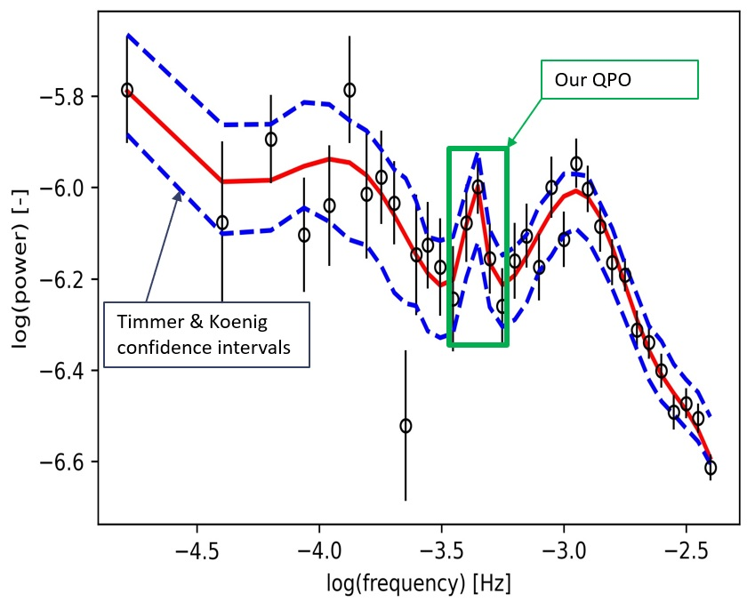

# Machine learning model for the detection of quasiperiodic oscillations in cataclysmic variables

This repository contains the scripts and models for the detection of QPOs of CVs. Our goal is to detect subtle quasiperiodic oscillations in cataclysmic variables. For our case study, we used the data of  MV Lyrae, namely its 272-day long light curve. Out of the light curve, we created periodograms and subsequently power density spectra.
To create a training dataset we simulated the data. We used two types of training data:
* numerical
* image

What is the motivation? Astronomers use old fashioned methods for estimating the confidence of QPO (e.g., [Timmer & Koenig](https://articles.adsabs.harvard.edu/pdf/1995A%26A...300..707T)). This method does not detect subtle QPO, only obvious ones. In our research we proposed a CNN to detect such QPO and thus provide a more reliable source for estimating confidence of QPO.

The QPOs we want to detect is depicted here: 

## Getting Started

### Prerequisites

List of Python libraries required to run the scripts:
* matplotlib
* numpy
* tensorflow
* pickle

### Folder structure

Folder structure (change if needed):
* [testdata/](./testdata) 
  * [4lor/](./testdata/4lor/) 
    * [lc/](./testdata/4lor/lc/)      
    * [pds/](./testdata/4lor/pds/)  
* [trendata/](./trendata/)
  * [lc5000/](./trendata/lc5000/)
    * [3lor/](./trendata/lc5000/3lor/)
    * [4lor/](./trendata/lc5000/4lor/)

* [CNN model history](./historyModel5000_lc)
* [MV Lyrae light curve](./lc_scaringi_all.dat)
* [CNN model](./model5000_lc.tflite)

* [Training script](./QPO_imagrecog_LC_train.py)
* [Testing script](./QPO_imagrecog_LC_test.py)

## Usage

The [Training script](./QPO_imagrecog_LC_train.py) is used to train the CNN on data. 
The [Testing script](./QPO_imagrecog_LC_test.py) tests the trained CNN on 10000 simulated data with the QPO. 
Follow the comments in each script for further navigation.

<!-- ## Contributing

Guidelines on how to contribute to the project.

-->
## Authors

List of authors who have contributed to the project:

* [Denis Benka](https://www.linkedin.com/in/denis-benka/)
* [Sabína Vašová](https://www.linkedin.com/in/sabina-vasova/)

## License

This project is licensed under the [MIT License] license - see the [LICENSE.md](LICENSE.md) file for details.
