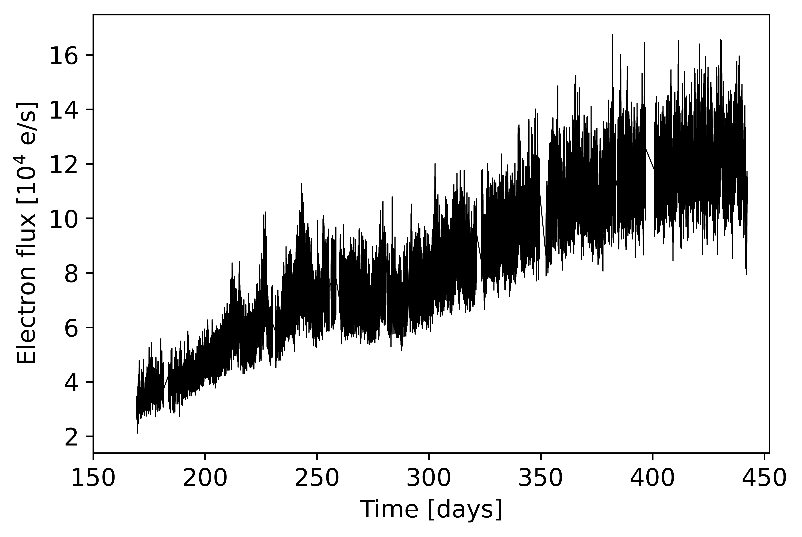

# Machine learning model for the detection of quasiperiodic oscillations in cataclysmic variables

This repository contains the scripts and models for the detection of Quasiperiodic oscillations (QPOs) of cataclysmic variables (CVs). Our goal is to detect subtle quasiperiodic oscillations in cataclysmic variables. For our case study, we used the data of a CV called MV Lyrae. We used the 272-day long light curve as captured by the Kepler satellite and stored in Mikulski Archive for Space Telescopes (MAST). Out of the light curve, we created periodograms and subsequently power density spectra.

To create a training dataset we simulated the data. We used two types of training data:
* numerical
* image

What is the motivation? Astronomers use old fashioned sigma intervals for estimating the confidence of QPO (e.g., [Timmer & Koenig](https://articles.adsabs.harvard.edu/pdf/1995A%26A...300..707T)). This method does not detect subtle QPO, only obvious ones. In our research we proposed a CNN to detect such QPO and thus provide a more reliable source for estimating confidence of QPO.

The light curve we use is shown here:

Since it is not clear, whether (or if) there are any QPO, we need to further process the light curve. Our approach includes the creation of periodograms and subsequently a power density spectrum. After undergoing the latter, we get a more clear image of our QPOs. The QPO we want to detect is depicted on the power density spectra here: 

This power density spectrum was fitted with a 5-component Lorentz model, commonly used to describe QPOs in astronomy. The fitted parameters were then used to create simulated light curves (according to Timmer & Koenig). We simulated two categories: with the QPO and without the QPO present. The data were saved in numerical form as well as power density spectra images as shown earlier. These were then used to feed the CNN model. The model was tested on 10000 simulated power density spectra. The best-in-case model yielded a 87% testing accuracy.

We tried a slightly different approach, namely, we used simulated light curves instead of power density spectra to train our model. To our surprise, this model achieved better performance, 98% testing accuracy, proving the effectiveness of our CNN and surpassing the Timmer & Koenig method of QPO confidence estimation.

The link to the model trained on simulated light curves can be found later in this repository.

## Getting Started

### Prerequisites

List of Python libraries required to run the scripts:
* matplotlib
* numpy
* tensorflow
* pickle

### Folder structure

Folder structure (change if needed):
* [testdata/](./testdata) 
  * [4lor/](./testdata/4lor/) 
    * [lc/](./testdata/4lor/lc/)      
    * [pds/](./testdata/4lor/pds/)  
* [trendata/](./trendata/)
  * [lc5000/](./trendata/lc5000/)
    * [3lor/](./trendata/lc5000/3lor/)
    * [4lor/](./trendata/lc5000/4lor/)

* [CNN model history](./historyModel5000_lc)
* [MV Lyrae light curve raw data](./lc_scaringi_all.dat)
* [CNN model](./model5000_lc.tflite)

* [Training script](./QPO_imagrecog_LC_train.py)
* [Testing script](./QPO_imagrecog_LC_test.py)

## Usage

The [Training script](./QPO_imagrecog_LC_train.py) is used to train the CNN on data. 
The [Testing script](./QPO_imagrecog_LC_test.py) tests the trained CNN on 10000 simulated data with the QPO. 
Follow the comments in each script for further navigation.

<!-- ## Contributing

Guidelines on how to contribute to the project.

-->
## Authors

List of authors who have contributed to the project:

* [Denis Benka](https://www.linkedin.com/in/denis-benka/)
* [Sabína Vašová](https://www.linkedin.com/in/sabina-vasova/)

## License

This project is licensed under the [Creative Commons Zero v1.0 Universal] license - see the [LICENSE.md](LICENSE.md) file for details.
